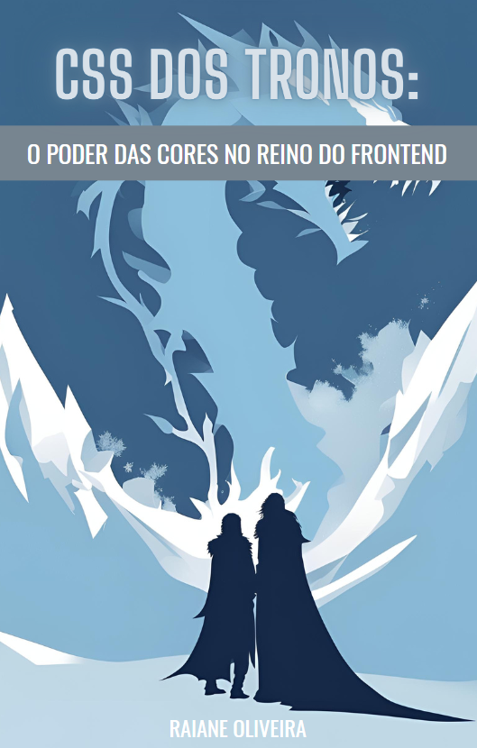

# CSS DOS TRONOS: O PODER DAS CORES NO REINO DO FRONTEND

Este é um projeto criado com a ajuda de uma IA para fins didáticos.

A ideia do e-book é explicar a importância de um design bem pensado no ambiente de desenvolvimento web utilizando a obra fictícia Game of Thrones, de George R. R. Martin, como forma de contextualizar e comparar situações do mundo real com a narrativa da trama em questão. Espero que goste!

## Tecnologias utilizadas:

- ChatGPT
- Copilot
- Canva AI
- Snappfy
